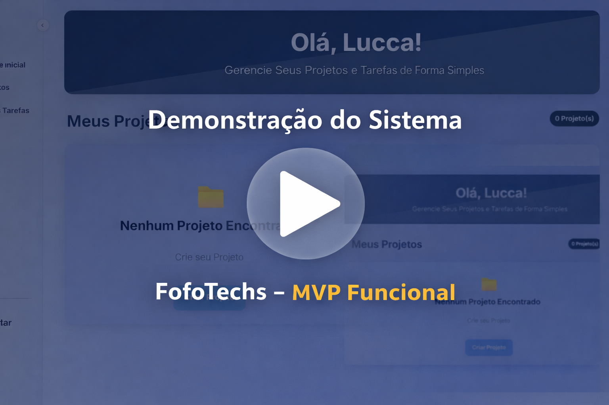

🎯 FofoTechs – Gerenciador de Tarefas Gamificado

O FofoTechs é uma aplicação web desenvolvida como Trabalho de Conclusão de Curso (TCC) no curso de Análise e Desenvolvimento de Sistemas – UNICID.

O projeto propõe uma abordagem inovadora para a organização de tarefas e gestão de projetos, utilizando gamificação como estratégia para aumentar o engajamento, a produtividade e a disciplina de colaboradores e equipes ágeis.

🧩 Visão Geral

O FofoTechs combina conceitos de:

Gestão de projetos (Kanban)

Gamificação

Análise de sistemas

Modelagem de dados

Desenvolvimento web full stack

A aplicação transforma a execução de tarefas em uma experiência interativa, baseada em:

Avanço em um tabuleiro de progresso

Acúmulo de saldo (moedas)

Conquista de recompensas

🎯 Objetivo Geral

Desenvolver uma plataforma de organização de tarefas que motive os usuários por meio de mecânicas de jogo, incentivando o cumprimento de metas e o desenvolvimento de hábitos produtivos no ambiente corporativo.

🎯 Objetivos Específicos

Organização: permitir a criação de projetos, tarefas e equipes

Produtividade: reduzir procrastinação e melhorar foco

Gamificação: recompensar usuários pela conclusão de tarefas

Engajamento: aumentar motivação e senso de progresso

Gestão: oferecer controle claro do fluxo de trabalho para administradores

⚙️ Funcionalidades Implementadas
Categoria	Descrição	Status
Autenticação	Cadastro, login e recuperação de senha por e-mail	✅
Gestão de Projetos	Criação de projetos e dashboards	✅
Gestão de Membros	Convite e gerenciamento de participantes	✅
Gestão de Tarefas	Kanban (Todo, Doing, Done), prioridades e responsáveis	✅
Gamificação	Tabuleiro, saldo e recompensas por progresso	✅
Histórico	Logs de saldo, recompensas e ranking	✅
🎮 Sistema de Gamificação

O principal diferencial do FofoTechs é seu sistema de gamificação integrado à lógica de tarefas:

O usuário conclui tarefas

Ganha saldo (moedas)

Avança posições no tabuleiro do projeto

Desbloqueia recompensas baseadas na posição alcançada

Esse mecanismo incentiva constância, foco e colaboração entre os membros da equipe.

🎥 Demonstração em Vídeo

O vídeo abaixo apresenta o funcionamento do FofoTechs durante o período de implantação do MVP,
demonstrando as principais funcionalidades do sistema e a lógica de gamificação.

👉 Clique para assistir:

🧩 Stack Tecnológica
Camada	Tecnologia
Front-end	HTML5, CSS3, JavaScript
Back-end	Python (Flask)
Banco de Dados	MySQL
Infraestrutura	Railway (App + Banco)
Ferramentas	Git, VS Code, MySQL Workbench
🚀 Implantação do MVP

O FofoTechs foi implantado em ambiente de nuvem durante a fase de MVP, com o objetivo de validar o funcionamento completo da aplicação em um cenário real.

Atualmente, o ambiente de produção encontra-se desativado por limitações de hospedagem, permanecendo este repositório como registro técnico e acadêmico do projeto.

⚠️ Limitações Conhecidas

O sistema não está ativo em produção no momento

O projeto não possui configuração simplificada para execução local

A estrutura completa do banco de dados não está disponível no repositório por motivos acadêmicos

🎓 Contexto Acadêmico

Projeto desenvolvido como Trabalho de Conclusão de Curso (TCC) na disciplina Análise e Projeto de Sistemas II – UNICID.

Documentos produzidos:

TAP (Termo de Abertura do Projeto)

Análise de Requisitos

DER e Modelo Lógico

Registro de Partes Interessadas

📜 Licença

Este projeto possui finalidade exclusivamente acadêmica.
Para uso, modificação ou redistribuição, entre em contato com os autores.

© 2025 – Equipe FofoTechs. Todos os direitos reservados.