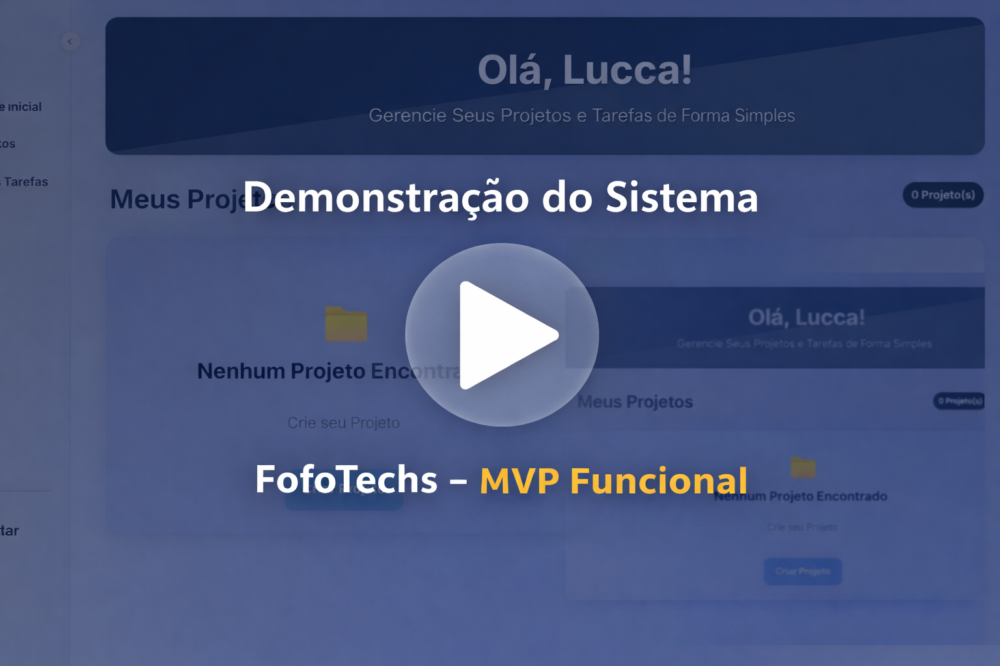

# FofoTechs – Gerenciador de Tarefas Gamificado

Aplicação web desenvolvida como **Trabalho de Conclusão de Curso (TCC)** no curso de **Análise e Desenvolvimento de Sistemas – UNICID**.

O FofoTechs transforma a rotina de gerenciamento de projetos em uma experiência gamificada. Ao concluir tarefas, colaboradores acumulam saldo, avançam em um tabuleiro de progresso e desbloqueiam recompensas — incentivando constância, foco e engajamento coletivo.

---

## Objetivo

Desenvolver uma plataforma de organização de tarefas corporativas que motive equipes por meio de mecânicas de jogo, promovendo o cumprimento de metas e hábitos produtivos no ambiente de trabalho.

O foco está na integração entre **gestão ágil de projetos** e **gamificação aplicada**, com ênfase em usabilidade, clareza do fluxo de trabalho e senso de progresso para os colaboradores.

---

## Estrutura do Repositório

```
projeto_apsII/
├── routes/                    # Blueprints Flask por domínio (auth, projetos, tarefas...)
├── static/                    # Assets estáticos (CSS, JavaScript, imagens)
├── templates/                 # Templates HTML
├── docs/
│   └── prints/                # Capturas de tela e capa do vídeo de demonstração
├── app.py                     # Inicialização e configuração da aplicação Flask
├── database.py                # Conexão e helpers do banco de dados MySQL
├── requirements.txt           # Dependências Python do projeto
├── Procfile                   # Configuração de deploy no Railway
└── README.md                  # Este arquivo
```

---

## Funcionalidades

### Autenticação
Cadastro de novos usuários, login com sessão persistente e recuperação de senha por e-mail.

### Gestão de Projetos
Criação de projetos com dashboard individual por equipe, acompanhamento de status e visibilidade do progresso coletivo.

### Gestão de Membros
Convite de colaboradores via e-mail, definição de papéis e controle de acesso por projeto.

### Kanban de Tarefas
Organização visual das atividades em três colunas — **Pendente → Em andamento → Concluída** — com suporte a prioridades, responsáveis e prazos definidos.

### Sistema de Gamificação
Ao concluir tarefas, o colaborador recebe uma moeda pela atividade realizada, avança posições no tabuleiro do projeto e desbloqueia recompensas configuradas pelo administrador. O mecanismo cria um ciclo contínuo de motivação e reconhecimento dentro da equipe.

### Histórico e Ranking
Registro de todas as movimentações de saldo, recompensas conquistadas e posição de cada membro no ranking de desempenho do projeto.

---

## Demonstração

O vídeo abaixo apresenta o FofoTechs em funcionamento durante o período de implantação do MVP, cobrindo as principais funcionalidades e a lógica de gamificação aplicada.

[](https://youtu.be/hiU5Sy9Jf-o)

---

## Stack Tecnológica

**Back-end:** Python 3 com Flask, organizado em Blueprints por domínio

**Front-end:** HTML5, CSS3 e JavaScript

**Banco de Dados:** MySQL, gerenciado via `database.py` com conexão direta

**Infraestrutura:** Railway para hospedagem da aplicação e do banco em nuvem, com deploy via `Procfile`

**Ferramentas:** Git, VS Code, MySQL Workbench

---

## Implantação do MVP

O sistema foi implantado em ambiente de nuvem durante a fase de MVP para validação em cenário real com usuários ativos. O ambiente de produção encontra-se atualmente **desativado por limitações de hospedagem**. Este repositório permanece como registro técnico e acadêmico do projeto.

---

## Limitações Conhecidas

- O ambiente de produção não está ativo no momento
- Não há configuração simplificada para execução local (variáveis de ambiente e banco precisam ser configurados manualmente)
- O schema completo do banco de dados não está disponível no repositório por motivos acadêmicos

---

## Contexto Acadêmico

Projeto desenvolvido como TCC na disciplina **Análise e Projeto de Sistemas II – UNICID**.

Documentos produzidos ao longo do projeto: TAP (Termo de Abertura do Projeto), Análise de Requisitos, DER e Modelo Lógico do Banco de Dados, e Registro de Partes Interessadas.

---

## Licença

Este projeto possui finalidade exclusivamente acadêmica.  
Para uso, modificação ou redistribuição, entre em contato com os autores.

© 2025 – Equipe FofoTechs. Todos os direitos reservados.
